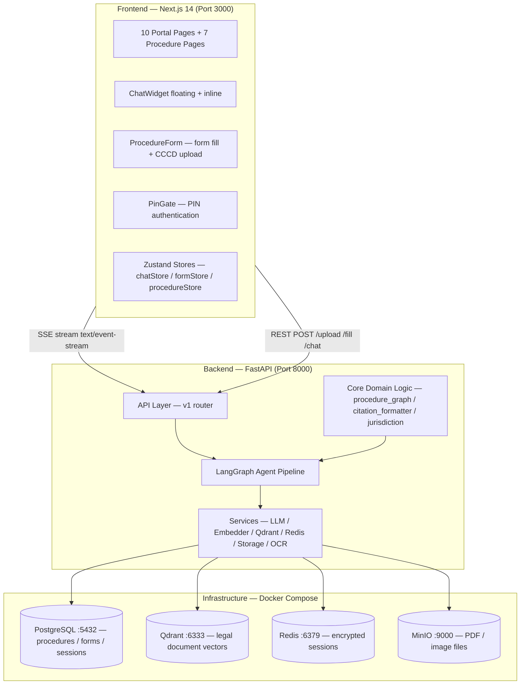

# Section 01 — System Overview

## 1.1 System Vision

DichVuCong AI Assistant is a mock Vietnamese government public administration portal that adds a conversational AI layer on top of an otherwise static service directory. The system is implemented as a research prototype, not a production deployment. Its core problem is **navigational complexity**: Vietnamese citizens must complete multiple interdependent administrative procedures in a specific order, and the legal basis for each step is scattered across dozens of decrees and circulars.

The system is built around a **procedure dependency graph** (DAG) stored in PostgreSQL. All AI capabilities — RAG, OCR, and form auto-fill — exist to serve that graph: RAG answers legal questions about why a procedure requires certain documents, OCR extracts personal data from identity documents so it can be carried forward into form fields, and form fill automates the tedious transcription of data across multiple government PDF templates.

As of v3.81 (2026-05-08), the system is at active research prototype maturity: 366 unit tests passing, 19 legal documents ingested (~905 Qdrant points), 7 procedures seeded across 3 domains, 8 form templates implemented, and a complete SSE streaming chat interface.

## 1.2 Scientific Contribution

The system validates the following architectural claim:

> A single unified pipeline architecture is sufficient to handle both procedural dependency resolution (DAG-based) and hierarchical jurisdiction scoping (tree-based) for Vietnamese administrative procedures, and this architecture is domain-agnostic with respect to procedure type.

This is validated empirically across three domains:

- **Housing** (nhà ở): TTHC-001, TTHC-002, TTHC-003 — three-level scope (VN → VN-HCM → ward)
- **Civil registration** (hộ tịch): TTHC-CR-001, TTHC-CR-002 — DAG edge validated: TTHC-CR-002 requires TTHC-CR-001 per Điều 63–64 Luật Hộ tịch 2014
- **Adoption** (nuôi con nuôi): TTHC-AD-001, TTHC-AD-002 — DAG edge validated: TTHC-AD-002 requires TTHC-AD-001 per Điều 24 Nghị định 123/2015/NĐ-CP

The contribution holds as stated. Scaling within a domain is a data and ingestion task; scaling across domains requires only router prompt coverage and correctly tagged legal documents.

## 1.3 System Layers Diagram

## 1.4 Current Scope (as implemented, v3.81)

The following are **implemented and functional**:
- 10 portal pages + 7 procedure pages under `/thu-tuc/`
- Floating + inline ChatWidget with SSE streaming, citation chips, typing indicator
- Full LangGraph pipeline: router → enrichment → plan_executor (loop) → synthesizer
- RAG pipeline: hybrid dense+BM25 RRF retrieval, citation verification, jurisdiction cascade
- OCR pipeline: QR-first + PaddleOCR two-path, LLM field extraction
- Form fill pipeline: python-docx fill + LibreOffice PDF conversion for 8 form templates across 7 procedures
- Session persistence: Fernet-encrypted Redis sessions (6-turn history window)
- Rate limiting: 10/min chat, 5/min upload via slowapi
- Guided wizard: 4-state machine (INTRO → AWAIT_CCCD → FORM_FILLING → COMPLETE) for all 7 procedures
- PIN gate: sessionStorage-based, configurable via NEXT_PUBLIC_ACCESS_PIN
- Ngrok support: CORS_EXTRA_ORIGINS env var for public tunnel access
- Agent Activity Panel: real-time agentic flow visualization via SSE pipeline events (v3.80)
- Router benchmark dataset: 81 labeled cases (v3.81)

**Not in scope (acknowledged):**
- UI/UX design polish beyond functional prototype level
- Full national ward coverage (only 3 test wards seeded)
- Production security hardening
- Legal correctness certification (Tier 3 validation)
- Document authority hierarchy modeling (P16 — deferred)
