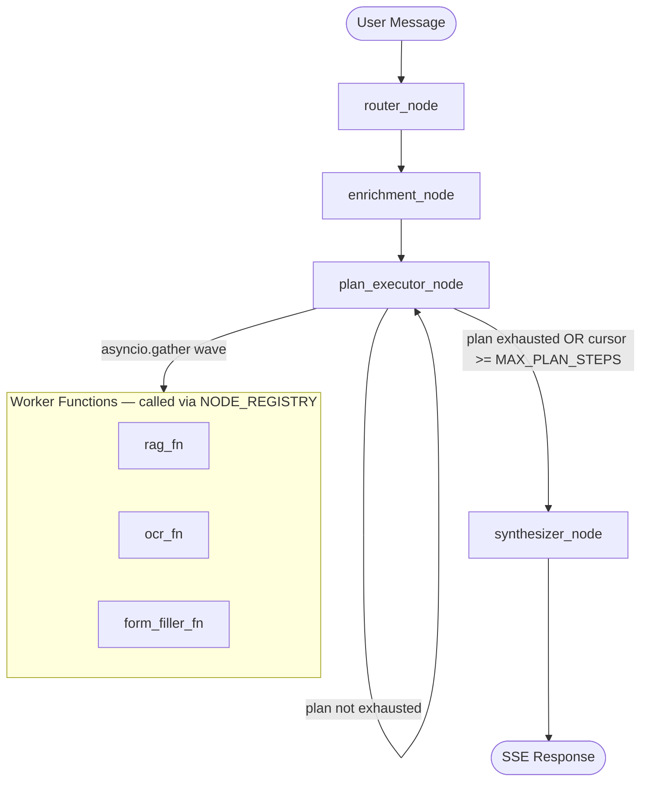

# Section 03 — Multi-Agent Pipeline

## 3.1 LangGraph Topology

The graph is a **linear loop** — not a conditional fan-out. The entry point is `router_node`. All nodes are compiled with `recursion_limit=10` (via `graph.compile()` in `graph.py`). `GraphRecursionError` is caught at the chat endpoint level.



**Graph assembly** (from `backend/app/agents/graph.py`):
- Entry: `router_node`
- Linear edges: `router_node → enrichment_node → plan_executor_node`
- Conditional edges on `plan_executor_node`: `route_plan_executor()` returns `"plan_executor_node"` (loop) or `"synthesizer_node"` (done)
- Terminal edge: `synthesizer_node → END`
- Compiled once at module level as `agent_graph`; imported by the chat endpoint — never rebuilt per request

## 3.2 True Graph Nodes

There are exactly **4 true graph nodes** wired into the LangGraph graph:

| Node | File | Inputs | Outputs |
|---|---|---|---|
| `router_node` | `nodes/router.py` | `user_message`, `uploaded_image_path`, `guided_procedure_id`, `guided_step` | `execution_plan`, `entities`, `plan_cursor=0`, optionally `intent`, `target_procedure_id`, `location_scope`, `domain`, `guided_procedure_id`, `guided_step`, `out_of_scope` |
| `enrichment_node` | `nodes/enrichment.py` | `target_procedure_id`, `execution_plan` | `procedure_execution_plan` (from `procedure_planner_fn`) OR `{}` (no-op) |
| `plan_executor_node` | `nodes/plan_executor.py` | `execution_plan`, `plan_cursor`, `errors` | Worker outputs merged into state + updated `plan_cursor` |
| `synthesizer_node` | `nodes/synthesizer.py` | Entire accumulated AgentState | `final_response`, `response_metadata` |

## 3.3 Worker Functions

Worker functions are plain Python async functions called by `plan_executor` via `NODE_REGISTRY`. They are **never** LangGraph graph nodes.

| Worker | File | Dependencies | Inputs (from state) | Outputs (partial state dict) |
|---|---|---|---|---|
| `rag_fn` | `nodes/rag.py` | None | `user_message`, `target_procedure_id`, `location_scope`, `filing_jurisdiction`, `conversation_history` | `retrieved_chunks`, `citations`, `scope_used`, `final_response`, `rag_returned_empty`, `response_metadata` |
| `ocr_fn` | `nodes/ocr.py` | None | `uploaded_image_path` | `extracted_personal_data`, `document_type` |
| `form_filler_fn` | `nodes/form_filler.py` | `ocr_fn` | `target_procedure_id`, `personal_data`, `extracted_personal_data`, `session_id` | `form_id`, `filled_fields`, `unfilled_required_fields`, `filled_form_path`, `form_fill_complete` |

**`procedure_planner_fn`** (`nodes/procedure_planner.py`) is NOT in `NODE_REGISTRY` and NOT a valid `execution_plan` step. It is called **directly by `enrichment_node`** as an internal helper — never scheduled as a plan step.

## 3.4 NODE_REGISTRY and VALID_PLAN_STEPS

From `backend/app/agents/node_registry.py`:

```python
VALID_PLAN_STEPS: frozenset[str] = frozenset({"rag_fn", "ocr_fn", "form_filler_fn"})

NODE_DEPENDENCIES: dict[str, list[str]] = {
    "rag_fn": [],
    "ocr_fn": [],
    "form_filler_fn": ["ocr_fn"],
}

NODE_REGISTRY = {
    "rag_fn": rag_fn,
    "ocr_fn": ocr_fn,
    "form_filler_fn": form_filler_fn,
}
```

An import-time assertion enforces `NODE_REGISTRY.keys() == VALID_PLAN_STEPS` — drift causes immediate crash at startup.

## 3.5 Parallel Wave Execution Model

`plan_executor_node` uses `_compute_wave()` to group steps whose dependencies are satisfied, then runs them concurrently with `asyncio.gather()`. This gives parallel execution where possible:

- For `["ocr_fn", "rag_fn", "form_filler_fn"]`: Wave 1 = `{ocr_fn, rag_fn}` (both have no deps), Wave 2 = `{form_filler_fn}` (depends on `ocr_fn` which completed in Wave 1)
- For `["rag_fn"]`: Wave 1 = `{rag_fn}`, single worker

**Circuit-breaker**: `MAX_PLAN_STEPS = 8` (read from env var at import time). When `plan_cursor >= 8`, the node appends a Vietnamese error message to `errors[]` and returns — routing to synthesizer which activates `circuit_breaker` mode.

## 3.6 Router Node Details

The router uses a **lazy singleton** `_router_llm` (initialized on first call). The backend is determined by `settings.ROUTER_LLM_BACKEND` (default: `"anthropic"`).

**Three execution paths** (in priority order, all before LLM call):
1. **Exit guard** (zero LLM tokens): if `guided_procedure_id` set AND message contains exit phrase → clears guided mode
2. **State 2 bypass** (zero LLM tokens): if `guided_step == 2` → always routes to OCR/form without LLM
3. **Normal LLM path**: calls `_get_router_llm().async_invoke()` with `max_tokens=512`

**RouterOutput schema** (Pydantic model):
```python
class RouterOutput(BaseModel):
    execution_plan: list[str]
    entities: dict[str, Any] = {}
    intent: str | None = None        # "start_guided" | "out_of_scope" | "rag_query" | None
    procedure_id: str | None = None  # e.g. "TTHC-001"
    location_scope: str | None = None  # "VN-HCM" | "VN-HN" | "VN-DN" | null
```

**Step name validation**: done in `router_node` AFTER parsing (not in Pydantic), so invalid steps raise `ValueError` (prompt drift detection), not `ValidationError` (which would produce silent fallback).

**Few-shot examples**: The router system prompt contains **36+ Ví dụ examples** (43 occurrences of "Ví dụ" appear in the file; some refer to same example set from different angles). Examples cover all 7 procedures, 3 domains, out-of-scope detection, prompt injection, location scope detection, and elliptical follow-up queries.

**Valid city scopes**: `VALID_CITY_SCOPES = {"VN-HCM", "VN-HN", "VN-DN"}` — any other value from the LLM is silently coerced to None.

**`_enforce_ordering()`**: Post-processes plan to ensure `ocr_fn` precedes `form_filler_fn` when both present — fixes LLM ordering errors silently.

## 3.7 Enrichment Node — Two-Condition Guard

From `backend/app/agents/nodes/enrichment.py`:

```python
async def enrichment_node(state: AgentState) -> dict:
    if not state.get("target_procedure_id"):
        return {}                    # Condition 1 failed — no-op
    if "form_filler_fn" not in state.get("execution_plan", []):
        return {}                    # Condition 2 failed — no-op
    return await procedure_planner_fn(state)
```

**Rationale**: A user asking a legal question about a procedure does NOT need the full DAG injected. Only when form filling is actually requested does the enrichment have value. This is the primary token-saving mechanism.

No LLM call is ever made by enrichment_node. Typical execution time: < 50ms (DB query + topological sort).

## 3.8 AgentState Field Inventory

From `backend/app/agents/state.py` (all fields documented):

| Field | Type | Set By | Read By |
|---|---|---|---|
| `user_message` | `str` (Required) | chat.py (entry) | router_node, synthesizer_node, rag_fn |
| `session_id` | `str` (Required) | chat.py (entry) | redis_service, form_filler_fn |
| `iteration_count` | `int` (Required) | chat.py (entry) | plan_executor_node (circuit-breaker) |
| `uploaded_image_path` | `str \| None` | chat.py (from session or body) | router_node, ocr_fn |
| `execution_plan` | `list[str]` | router_node | plan_executor_node, enrichment_node |
| `plan_cursor` | `int` | router_node (=0), plan_executor_node | plan_executor_node, route_plan_executor |
| `entities` | `dict[str, Any]` | router_node | synthesizer_node (indirect) |
| `domain` | `str \| None` | router_node | synthesizer_node (comment: "housing" \| "civil_registration" \| "adoption"; state.py has stale comment mentioning "business_registration") |
| `location_scope` | `str \| None` | router_node | rag_fn (scope cascade) |
| `filing_jurisdiction` | `str \| None` | chat.py (from session data) | synthesizer_node (scope fallback), rag_fn |
| `conversation_history` | `list[dict]` | chat.py (from Redis session, capped to 6) | synthesizer_node, rag_fn prompts |
| `retrieved_chunks` | `list[DocumentChunk]` | rag_fn | synthesizer_node |
| `citations` | `list[Citation]` | rag_fn | synthesizer_node (indirect via retrieved_sources) |
| `scope_used` | `str \| None` | rag_fn | synthesizer_node (_check_scope_fallback) |
| `personal_data` | `PersonalData \| None` | chat.py (from Redis, carry-forward) | form_filler_fn |
| `extracted_personal_data` | `PersonalData \| None` | ocr_fn | form_filler_fn (merge before fill) |
| `document_type` | `str \| None` | ocr_fn | synthesizer_node (response_metadata) |
| `target_procedure_id` | `str \| None` | router_node | enrichment_node, rag_fn, form_filler_fn |
| `procedure_execution_plan` | `list[ProcedureStep]` | enrichment_node (via procedure_planner_fn) | synthesizer_node (form_fill_complete context) |
| `completed_procedures` | `list[str]` | chat.py (from Redis session) | procedure_planner_fn (gap analysis) |
| `form_id` | `str \| None` | form_filler_fn | synthesizer_node |
| `filled_fields` | `dict[str, Any]` | form_filler_fn | synthesizer_node |
| `unfilled_required_fields` | `list[str]` | form_filler_fn | synthesizer_node (_determine_mode) |
| `filled_form_path` | `str \| None` | form_filler_fn | synthesizer_node (response_metadata for download) |
| `form_fill_complete` | `bool` | form_filler_fn | synthesizer_node, router_node (State 2 next_step logic) |
| `guided_procedure_id` | `str \| None` | router_node, synthesizer_node | router_node (Guard 1+2), synthesizer_node, chat.py (Redis save) |
| `guided_step` | `int \| None` | router_node, synthesizer_node | router_node (Guard 2), synthesizer_node (_determine_mode) |
| `final_response` | `str` | rag_fn (pre-synthesizer), synthesizer_node | chat.py (SSE stream), synthesizer_node (rag_only optimisation) |
| `response_metadata` | `dict` | rag_fn, synthesizer_node | chat.py (SSE metadata event) |
| `out_of_scope` | `bool` | router_node | synthesizer_node (highest-priority mode) |
| `rag_returned_empty` | `bool` | rag_fn | synthesizer_node (_determine_mode) |
| `errors` | `list[str]` | plan_executor_node (worker exceptions), rag_fn | synthesizer_node (_determine_mode) |

**Stale note**: `domain` field comment in `state.py` lists `"business_registration"` as a valid value — this is stale. The actual valid domain values as of v3.5 are `"housing"`, `"civil_registration"`, `"adoption"`.

## 3.9 Synthesizer Modes — Exhaustive List

From `backend/app/agents/nodes/synthesizer.py`, `_determine_mode()` and `synthesizer_node()`:

| Priority | Mode | Trigger Condition | LLM Call? |
|---|---|---|---|
| 0 | `out_of_scope` | `state["out_of_scope"] is True` | No — fixed Vietnamese refusal string |
| 1 | `rag_empty` | `rag_returned_empty AND intent not in ("form_fill", "start_guided", "continue_guided")` | No — fixed Vietnamese explanation |
| 2 | `error` | `state["errors"]` is non-empty | Yes — error mode synthesis prompt |
| 3 | `circuit_breaker` | `plan_cursor >= MAX_PLAN_STEPS AND errors empty` | Yes — circuit-breaker synthesis prompt |
| 4 | `guided_step` | `state["guided_step"] is not None` | Conditional — no LLM for hardcoded INTRO/FORM_FILLING states for new-domain procedures; yes LLM for housing procedures |
| 5 | `form_fill_complete` | `state["form_fill_complete"] is True` | Yes — form fill complete synthesis prompt |
| 6 | `form_fill_partial` | `state["unfilled_required_fields"]` is non-empty | Yes — partial fill synthesis prompt |
| 7 | `rag_only` | `state["retrieved_chunks"]` is non-empty | **Conditional** — skips LLM when no scope notice needed (uses `final_response` from `rag_fn` directly); calls LLM when scope fallback notice must be woven in |
| 8 | `fallback` | None of the above | Yes — fallback synthesis prompt (lists all 7 procedures) |

**`rag_only` LLM optimisation**: When `filing_jurisdiction == scope_used` (or either is None), the synthesizer returns `state["final_response"]` directly without an LLM call. This is the most common path for simple legal queries.

**Guided step hardcoded paths**: For non-housing procedures (`TTHC-CR-001/002`, `TTHC-AD-001/002`):
- State 0 (INTRO): hardcoded Vietnamese message per procedure — no LLM
- State 2 (FORM_FILLING): hardcoded instruction to use the procedure page form — no LLM, then exits guided mode

**`strip_markdown()`** from `app.core.text_utils` is applied to ALL LLM-generated responses in the synthesizer before writing to `final_response`.

## 3.10 Chat Endpoint Integration

From `backend/app/api/v1/chat.py` (v3.80 onward):

The chat endpoint uses `agent_graph.astream_events(version="v2")` (migrated from `ainvoke` in v3.80) to produce both text streaming AND pipeline event streaming via SSE.

SSE event format has two types:
1. `data: {"type": "content", "content": "..."}` — text chunks (3-char Unicode groups, 8ms intervals)
2. `event: pipeline_event\ndata: {"event_type": "...", ...}` — pipeline events (10 types defined in `schemas/pipeline_events.py`)

`GraphRecursionError` is caught inside the `generate()` SSE generator and emitted as an error chunk (HTTP 200, not 500).

Session hydration pattern:
1. Load session from Redis (via `redis_service.get_session()`)
2. Construct `AgentState` with capped conversation_history (`[-6:]`)
3. Run `agent_graph.astream_events()`
4. Save session back to Redis after graph completes
