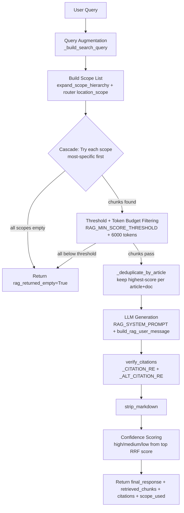
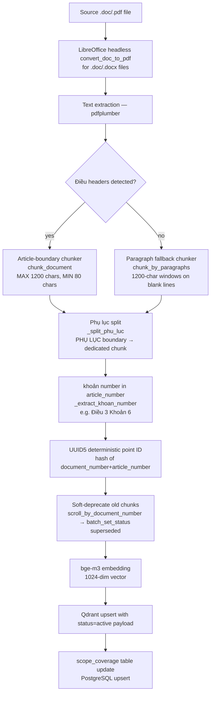

# Section 04 — RAG Pipeline

## 4.1 Configuration Parameters

From `backend/app/config.py`:

| Parameter | Value | Notes |
|---|---|---|
| `RAG_TOP_K` | 24 | Increased from 8 → 16 (v3.53) → 24 (v3.60) |
| `RAG_TOKEN_BUDGET` | 6000 | Max tokens in combined retrieved context |
| `RAG_MIN_SCORE_THRESHOLD` | 0.01 | RRF scores top out at ~0.033; was incorrectly set to 0.3 (silently filtered all chunks) — fixed in v3.3 |
| `QDRANT_COLLECTION` | `"legal_documents"` | Single collection for all domains |
| `QDRANT_VECTOR_SIZE` | 1024 | bge-m3 embedding dimension |

## 4.2 Query-Time RAG Pipeline



## 4.3 Query Augmentation

Implemented in `rag_fn._build_search_query()` (v3.63):

Short queries (< 10 words) are augmented by prepending context from the last assistant response. The context size scales linearly:
- 0 words → ~450 chars (from `_AUGMENT_MAX_CHARS=500`)
- 5 words → ~275 chars
- 9 words → ~95 chars (from `_AUGMENT_MIN_CHARS=50`)
- 10+ words → no augmentation

This augmentation targets the **Qdrant search query only** — the raw `user_message` is always passed unchanged to the LLM generation call.

## 4.4 Scope Cascade Fallback

The scope list is built from two sources:
1. `filing_jurisdiction` from session (e.g. `"VN-HCM-26968"`) → `expand_scope_hierarchy()` → reversed to most-specific-first
2. `location_scope` from router (e.g. `"VN-HCM"`) → prepended if not already in list

```python
# expand_scope_hierarchy("VN-HCM-26968") returns ["VN", "VN-HCM", "VN-HCM-26968"]
# After reversal for cascade: ["VN-HCM-26968", "VN-HCM", "VN"]
```

Cascade stops at the first scope that returns non-empty results. The `scope_used` field is propagated to the synthesizer for scope-fallback notice generation.

When `filing_jurisdiction` is None (most queries), `scope_list = ["VN"]` unless the router detected a city scope.

## 4.5 Hybrid Search — Dense + BM25 RRF

Both search stages use the same `_build_filter()` result, which always includes `status=active`.

### Dense Semantic Search
- Embeds the augmented query with bge-m3 (1024-dim)
- `qdrant_client.query_points()` with `limit=top_k*2` (candidate pool)
- Filter: `status=active AND [procedure_id if set] AND [scope if set]`

### BM25 Lexical Search
- Scrolls the **entire filtered corpus** (up to 10,000 points) with the same filter
- Builds `BM25Okapi` index from the scrolled content
- Tokenizes on whitespace; gets top `top_k*2` by BM25 score

**Important**: The BM25 index is built from the **filtered corpus** (same filter as dense search). This ensures procedure_id filtering applies to BM25 — not post-hoc filtering on an unfiltered index.

### Reciprocal Rank Fusion (RRF)

RRF formula with `k=60`:
```
rrf_score(doc) = 1/(rank_dense + 60) + 1/(rank_bm25 + 60)
```

Maximum RRF score: `1/(1+60) + 1/(1+60) ≈ 0.033` (for a chunk ranked 1st in both lists).

## 4.6 Per-Article Deduplication

`_deduplicate_by_article()` (added in v3.60) runs after RRF sorting, before `[:top_k]` slice:

- Keeps only the highest-scoring chunk per `(article_number, document_number)` key
- Prevents paragraph-fallback duplicates from flooding top-K (e.g., Điều 13 appearing 4 times)
- Khoản-split chunks (`"Điều 20 Khoản 1"`, `"Điều 20 Khoản 2"`) have distinct keys and are NOT collapsed

## 4.7 Token Budget Enforcement

Applied in `rag_fn` (not in `QdrantService`):

1. Sort chunks descending by `rrf_score`
2. For each chunk, check `rrf_score >= RAG_MIN_SCORE_THRESHOLD (0.01)` — stop if below
3. If `used_tokens > 6000 * 0.8` (80% of budget), use `chunk.structured_summary` instead of full content — skip if no summary
4. Stop when `used_tokens + chunk_tokens > 6000`
5. Token estimate: `len(text.split()) * 1.3` (word count × overhead factor)

`QdrantService.search()` also has its own token budget using `len(content) // 4` (char count / 4) as a rough token estimate. The `rag_fn` budget layer is the authoritative one.

## 4.8 Citation Verification

`verify_citations()` in `app/core/citation_formatter.py` runs after LLM generation.

### Primary citation format (Điều/Khoản)

Regex `_CITATION_RE` matches:
- `[Điều 11, Luật Hộ tịch 2014]`
- `[Điều 11 Khoản 2, Luật Hộ tịch 2014]`
- `[Điều 11 Khoản 2a, Luật Hộ tịch 2014]`
- `[Khoản 3, Điều 11, Nghị định 123/2015/NĐ-CP]`

**Verification logic:**
1. **Article-level**: `chunk.article_number` (stripped of "Điều " prefix and " Khoản N" suffix) must equal the article number AND `chunk.document_number` must appear in the citation text (case-insensitive substring)
2. **Khoản-level** (when citation includes khoản): checks content of ALL retrieved chunks matching (article, document) pair — not just the first. Three acceptance paths:
   - Direct substring ("Khoản 1" in content)
   - Numbered-list pattern ("1." or "- 1." at paragraph start)
   - Money pattern fallback (Vietnamese currency amounts in content)

### Alternative citation format (Mục/số/Phụ lục) — added v3.68

Regex `_ALT_CITATION_RE` matches NQ-HĐND fee-schedule citations:
- `[Mục A, số 1, 124/2016/NQ-HĐND]`
- `[số 3, Phụ lục, 124/2016/NQ-HĐND]`
- `[Phụ lục, 05/2025/NQ-HĐND]`

Verification is permissive: if the last comma-separated component (document number) matches any retrieved chunk's `document_number`, the citation is verified.

### Outcome

Unverified citations are replaced inline: `[unverified: Điều 99, 123/2021/NĐ-CP]`

**Known limitation**: Luật citations using the common name (e.g. `[Điều 20, Luật Cư trú năm 2020]`) will be flagged unverified when the chunk carries document_number `"68/2020/QH14"` — the verifier only uses payload data and has no name→document_number lookup table.

## 4.9 Confidence Scoring

Calibrated to the RRF score range (max ~0.033):

| Level | Condition |
|---|---|
| `high` | `top_score > 0.025 AND len(final_chunks) >= 3` |
| `medium` | `top_score > 0.016` |
| `low` | otherwise |

## 4.10 Ingestion-Time Pipeline



### Chunking Rules

- `MAX_CHUNK_CHARS = 1200` (enforced in `chunk_document()`)
- `MIN_CHUNK_CHARS = 80` (too-short chunks skipped)
- Chunks never span two Điều articles
- Phụ lục appendix sections are exempt from the 1200-char limit (fee tables must stay together)
- `_extract_khoan_number()` checks first 3 lines of each chunk for top-level numeric khoản pattern (`^\s*(\d+)\.\s+`) — stores as `"Điều N Khoản M"` in `article_number` payload

### UUID5 Deduplication

Deterministic point IDs: `uuid.uuid5(uuid.NAMESPACE_OID, f"{document_number}:{article_number}")`. Same article from an overlapping VBHN compilation → same UUID → upsert (not duplicate).

### Qdrant Payload Schema

Every point carries:
```json
{
  "legal_document_id": "UUID",
  "document_number": "123/2021/NĐ-CP",
  "article_number": "Điều 15",
  "content": "text...",
  "procedure_tags": ["TTHC-001"],
  "status": "active",
  "location_scope": "VN",
  "domain": "housing",
  "structured_summary": null
}
```

**`structured_summary`**: present in schema but `null` for all chunks — LLM-based offline generation was planned but never fully executed (v3.5 note: "all chunks have structured_summary: null").

## 4.11 RAG Prompt Injection Hardening

From `rag_prompt.py`, `build_rag_user_message()`:

Retrieved chunk context is wrapped in `<legal_context>` XML tags with an explicit instruction after the closing tag prohibiting following commands within the tags. This prevents adversarial content in legal documents from injecting instructions into the LLM.

```python
def build_rag_user_message(context: str, user_message: str) -> str:
    return f"<legal_context>\n{context}\n</legal_context>\n\nCâu hỏi: {user_message}"
```

A self-defense block in `RAG_SYSTEM_PROMPT` instructs the LLM to refuse role changes, persona switches, and system prompt extraction attempts.

## 4.12 Scope Coverage Tracking

The `scope_coverage` PostgreSQL table records which `(location_scope, procedure_id)` combinations have been ingested. The ingestion script upserts a row on every run. This enables:
- Knowing which scopes are available before querying Qdrant
- Distinguishing "no ward rule exists" from "ward rule not ingested yet"
- Benchmark evaluation: skipping unavailable combinations rather than counting them as pipeline failures
