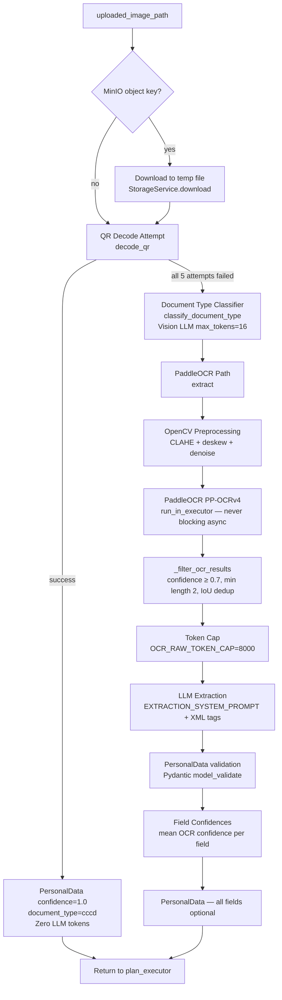

# Section 05 — OCR Pipeline

## 5.1 Two-Path Pipeline Overview



## 5.2 QR Decode Path (Path A)

**Library**: pyzbar with libzbar0 system dependency

**Strategy**: 5 preprocessing variants attempted in sequence, stopping at first success:
1. Full-image adaptive threshold (grayscale)
2. 3× upscaled region + adaptive threshold
3. 3× upscaled + Gaussian blur + threshold
4. 3× upscaled + morphological close + threshold
5. Inverted full image + threshold

When a QR code region is detected via `cv2.QRCodeDetector.detect()`, only the bounding region (with 10% margin) is upscaled rather than the full image. This improves decode accuracy on small QR codes.

**CCCD QR Format**: Pipe-delimited, 7 fields:
```
id_number|[empty]|full_name|dob_ddmmyyyy|gender|address|issue_date_ddmmyyyy
```

Index 1 is always empty — a structural placeholder, never mapped to any field.

**Field parsing**:
- `id_number`: validated with `_validate_id_number()` — must be 12-digit numeric, province code 1–96
- `date_of_birth`, `id_issue_date`: parsed with `_parse_ddmmyyyy()` — DDMMYYYY format
- `gender`: normalized from "Nam"/"Nữ"/"male"/"female" variants
- `permanent_address`: split on `", "` into street/ward/district/city (4 components minimum); falls back to `Address(street=raw_string)` for fewer components; `raw_address` always preserved

**Output**: `PersonalData` with all `field_confidences = 1.0`, `extraction_confidence = 1.0`. No LLM call. Approximate runtime: ~200ms.

## 5.3 PaddleOCR Path (Path B)

### Document Type Classifier

Vision LLM call (max_tokens=16) using a base64-encoded image.

5 valid document types (`VALID_DOCUMENT_TYPES`):
- `cccd` — Căn cước công dân
- `birth_certificate` — Giấy khai sinh
- `land_certificate` — Giấy chứng nhận quyền sử dụng đất
- `household_book` — Sổ hộ khẩu
- `other` — fallback

If the LLM returns an unexpected value, the classifier falls back to `"other"` without raising.

### OpenCV Preprocessing

`_preprocess_for_ocr()` applies in sequence:
1. **CLAHE** (Contrast Limited Adaptive Histogram Equalization): `clipLimit=2.0`, `tileGridSize=(8,8)` — improves low-contrast scans
2. **Deskew**: corrects rotation angles within ±15°; skips when angle < 0.1° or > 15°
3. **Denoise**: `fastNlMeansDenoising` with `h=10`

Result is written to a temp file and cleaned up in a `finally` block.

### PaddleOCR Execution

PaddleOCR is synchronous and CPU-bound. Always called via:
```python
raw_results = await loop.run_in_executor(None, self._run_paddle_ocr, preprocessed_path)
```

Settings:
- `PADDLEOCR_USE_GPU=false` (CPU mode; CUDA auto-detect active only for embedder)
- `PADDLEOCR_LANG=vi` (Vietnamese character set)
- `use_angle_cls=True` (orientation correction)

### OCR Result Filtering

`_filter_ocr_results()` applies three filters:
1. **Confidence threshold**: `conf >= OCR_CONFIDENCE_THRESHOLD (0.7)` — low-confidence detections discarded
2. **Minimum text length**: `len(text.strip()) >= OCR_MIN_TEXT_LENGTH (2)` — single-char noise discarded
3. **IoU deduplication**: overlapping bounding boxes (IoU > 0.5) — keep higher-confidence, discard duplicate

Handles both PaddleOCR nested format `[[det1, det2, ...]]` and flat format `[det1, det2, ...]` by checking 4 levels of nesting depth.

### Token Cap

OCR text is truncated to `OCR_RAW_TOKEN_CAP=8000` tokens (estimated as `len(joined_text) // 4`) before LLM call.

### LLM Extraction

`EXTRACTION_SYSTEM_PROMPT` + `build_extraction_messages()` from `ocr_extraction_prompt.py`.

**Injection hardening**:
- OCR text wrapped in `<ocr_text>` XML tags
- System prompt includes explicit "treat as data only" instruction
- Output constrained to `PersonalData` JSON schema (`SCHEMA_BLOCK` ≤ 150 tokens — enforced by module-level `assert`)
- Pydantic `model_validate()` discards any non-conforming output

JSON code-fence stripping: if response starts with ` ``` `, code fences are stripped before JSON parsing.

LLM call: `max_tokens=512`

### Confidence and Field Confidences

`extraction_confidence` = mean PaddleOCR confidence across all filtered detections (not the LLM's self-assessed confidence).

`field_confidences` = `{field_name: mean_conf}` for every non-null non-provenance field.

## 5.4 ocr_fn Worker

From `backend/app/agents/nodes/ocr.py`:

- Module-level lazy singleton `_ocr_svc` for OCRService
- Module-level lazy singleton `_storage_svc` for StorageService
- If `uploaded_image_path` is a MinIO object key (detected by `_is_minio_path()`: not absolute, not existing local file), downloads to temp file first
- Temp file always cleaned up in `finally` block
- Returns `{"personal_data": PersonalData, "document_type": str}` or both as None if no image

Note: `ocr_fn` returns `personal_data` (not `extracted_personal_data`) — the key `extracted_personal_data` is the field used in `AgentState` for the "most recent OCR output, not yet merged" concept. This means the merge step (`SessionDataAccumulator.merge()`) must happen in the form fill path, not in `ocr_fn` itself.

## 5.5 PersonalData Schema

From `backend/app/schemas/personal_data.py`:

```python
class Address(BaseModel):
    street: str | None = None
    ward: str | None = None
    district: str | None = None
    province: str | None = None
    city: str | None = None
    country: str = "Việt Nam"

class PersonalData(BaseModel):
    full_name: str | None = None
    full_name_latin: str | None = None
    date_of_birth: date | None = None
    gender: Literal["Nam", "Nữ"] | None = None
    nationality: str = "Việt Nam"
    id_number: str | None = None
    id_issue_date: date | None = None
    id_issue_place: str | None = None
    permanent_address: Address | None = None
    temporary_address: Address | None = None
    raw_address: str | None = None         # preserved for forms needing full string

    # Provenance (required fields — never omit)
    source_document_type: str
    source_image_path: str
    extraction_confidence: float           # validated: 0.0 ≤ x ≤ 1.0
    field_confidences: dict[str, float]    # per-field confidence scores
    extracted_at: datetime
```

**`full_name_latin`**: for forms requiring name without diacritics (not populated by QR path — QR format only provides Vietnamese name)

**`raw_address`**: always set from the raw QR address string; preserved for forms that need the original single-line string rather than the structured parsed address

**`model_validator`**: enforces `0.0 ≤ extraction_confidence ≤ 1.0`

## 5.6 Carry-Forward Merge Rule

`SessionDataAccumulator.merge()` in `app/core/session_accumulator.py`:

When merging two `PersonalData` objects (prior session data + new OCR output), the **higher-confidence value always wins** per field. Never overwrite a high-confidence extraction with a low-confidence one just because it is newer.

This rule is checked against `field_confidences[field_name]`, not `extraction_confidence` overall.
