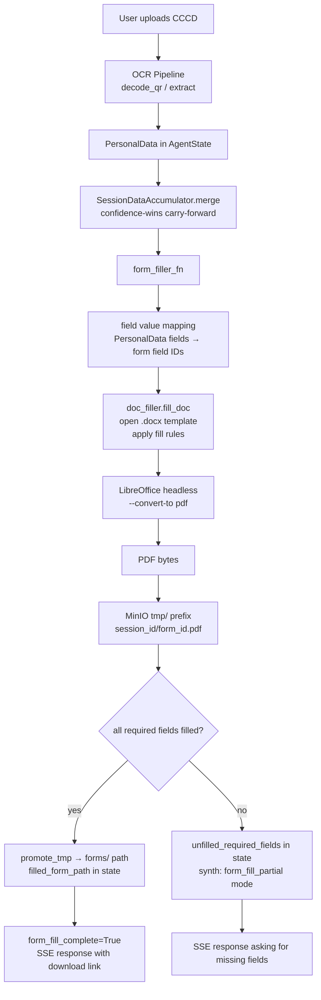

# Section 06 — Form Fill Pipeline

## 6.1 Two Form Fill Paths

The system has **two distinct form fill paths**:

| Path | File | Status | Used by |
|---|---|---|---|
| **Active** | `services/doc_filler.py` | Implemented, in live pipeline | `POST /api/v1/forms/fill`, `form_filler_fn` |
| **Inactive** | `services/pdf_service.py` | Implemented, tested, NOT in live pipeline | Nothing in production |

`doc_filler.py` fills `.docx` form templates via python-docx (dot-sequence replacement, CCCD grid fill, family table pre-fill) and converts to PDF via LibreOffice headless. This replaced the AcroForm PDF approach in v3.29.

`pdf_service.py` (AcroForm via pdfrw + reportlab overlay fallback) exists and is unit-tested but is not called by any live pipeline node or endpoint. Modifying it has no effect on the running system.

## 6.2 Form Fill Pipeline Flow

## 6.3 doc_filler.py — Active Form Fill Path

From `backend/app/services/doc_filler.py`:

**Fill rules applied in order:**

1. **Rule 1 — Dot-sequence replacement**: Scans all paragraphs (body + table cells). For each paragraph, identifies label text before dots/tabs and replaces dot sequences (`[.·…⋯]{3,}`) or tab characters with field values. Handles three sub-patterns:
   - Tab-based: `"Label:\t"` → value inserted after tab
   - Dot-based: `"Label:....."` → dots replaced by value
   - Multi-field: multiple label+dot groups in one paragraph

2. **Rule 2 — CCCD character grid fill**: Detects 1-row, 9+ cell tables with single-char cells. Fills each cell with one digit of the CCCD number.

3. **Rule 3 — Family member table row 1 pre-fill**: Detects family-member tables by header row recognition (keyword matching against "họ", "tên", "sinh", "giới", "tính", etc.). Pre-fills row 1 data cells by matching column header text to field IDs.

4. **Rule 4 — Signing sections always skipped**: Any paragraph/cell containing `"Ký, ghi rõ họ tên"`, `"Xác nhận của"`, `"ngày....tháng"`, `"CHỮ KÝ"`, or `"NGƯỜI KÝ"` is never modified.

**Label matching** (`_find_field_id()`): Two-pass matching:
- Pass 1: substring — either label is a substring of the other
- Pass 2: word-subset — all words in shorter token set appear in longer set

**Consumed tracking**: Field IDs consumed in a fill pass are tracked in a `set` to prevent the same field from being filled twice when a form has repeated label text (e.g., "Năm sinh" for both mother and father).

### LibreOffice Conversion

`_convert_docx_to_pdf()`:
1. Writes filled `.docx` bytes to temp file
2. Calls LibreOffice headless: `soffice.exe --headless --convert-to pdf --outdir <tmpdir> <docx>`
3. Run via `asyncio.get_running_loop().run_in_executor()` — never blocks event loop
4. Timeout: 60 seconds
5. Path: `C:\Program Files\LibreOffice\program\soffice.exe` (hardcoded Windows path)
6. Raises `RuntimeError` if LibreOffice not found or conversion fails

## 6.4 Form Templates

8 `.docx` form templates across all 7 procedures (from `form_field_configs.py`):

| Form File | Tab Label | Procedure(s) | Approx Field Count |
|---|---|---|---|
| `1.TKngkkhaisinh.docx` | Tờ khai đăng ký khai sinh | TTHC-CR-001 | ~25 |
| `1.TTT-ngkkhaisinh.docx` | Tờ khai nhận cha, mẹ, con | TTHC-CR-001 | ~20 |
| `18.TKyeucaubansaotrichluchotich.docx` | Tờ khai yêu cầu cấp bản sao | TTHC-CR-002 | ~18 |
| `18.DTTT-CpBSkhaisinhTrchlcHT.docx` | Đơn đề nghị cấp bản sao | TTHC-CR-002 | ~15 |
| `1.nxinnhnconnui.docx` | Đơn xin nhận con nuôi | TTHC-AD-001 | ~22 |
| `2.Vnbnxcnhnhoncnhgianhchiukinkinht.docx` | Văn bản xác nhận hoàn cảnh | TTHC-AD-001 | ~20 |
| `7.Tkhaingklivicnuiconnui.docx` | Tờ khai đăng ký lại | TTHC-AD-002 | ~18 |
| `1.MuCT01banhnhkmtheoThngts53.docx` | CT01 — Tờ khai đăng ký cư trú | TTHC-001, TTHC-002, TTHC-003 | 11 |

Total: approximately 146 field IDs across 8 forms (from grep count of `"id":` in `form_field_configs.py`).

**`cccd_source` field**: Each FormField may have a `cccd_source` value mapping it to a PersonalData field name (`full_name`, `date_of_birth`, `id_number`, `gender`, etc.). Fields with `cccd_source=null` require manual input from the user.

**Field types**: `text`, `date`, `year`, `textarea`, `select`, `radio`, `email`, `tel`

## 6.5 Field Mapping — form_filler_fn vs form_field_mapper.py

**`form_filler_fn`** (in `nodes/form_filler.py`): Reads `personal_data` and `extracted_personal_data` from state, merges them via `SessionDataAccumulator.merge()`, then maps PersonalData fields to form field values using the `cccd_source` mapping in `FORM_FILE_CONFIGS`.

**`form_field_mapper.py`** (`app/core/form_field_mapper.py`): LLM-based semantic field mapper — designed for dynamic mapping of arbitrary PDF field names to PersonalData fields. Uses an LLM call per template, with results cached in `form_templates.fields` JSONB column.

**Current state**: The active path (`doc_filler.py` + `form_filler_fn`) uses the static `cccd_source` mapping from `form_field_configs.py`, not the LLM mapper. The LLM mapper (`FormFieldMapper`) exists and is tested but is not called in the live pipeline. The cache (`form_templates.fields`) is not populated in production.

## 6.6 MinIO Storage for Filled Forms

- In-progress / unverified fills: `tmp/{session_id}/{form_id}.pdf`
- Complete fills (all required fields): promoted to `forms/{session_id}/{form_id}.pdf` via `StorageService.promote_tmp()`
- Partial fills are never promoted — only the `tmp/` path is stored in state
- Download endpoint: `GET /api/v1/documents/download?path=...` — session-scoped 403 guard

## 6.7 POST /api/v1/forms/fill Endpoint

Direct endpoint for form fill without the agent pipeline:
- Accepts: `procedure_id`, `form_file`, `field_values` (dict)
- Calls `doc_filler.fill_doc()` directly
- Returns: PDF bytes with `Content-Type: application/pdf`
- `Content-Disposition`: `attachment; filename=*.pdf`

`GET /api/v1/forms/configs/{procedure_id}`: Returns the field config list for the specified procedure's forms — consumed by the frontend `ProcedureForm` component on mount.
