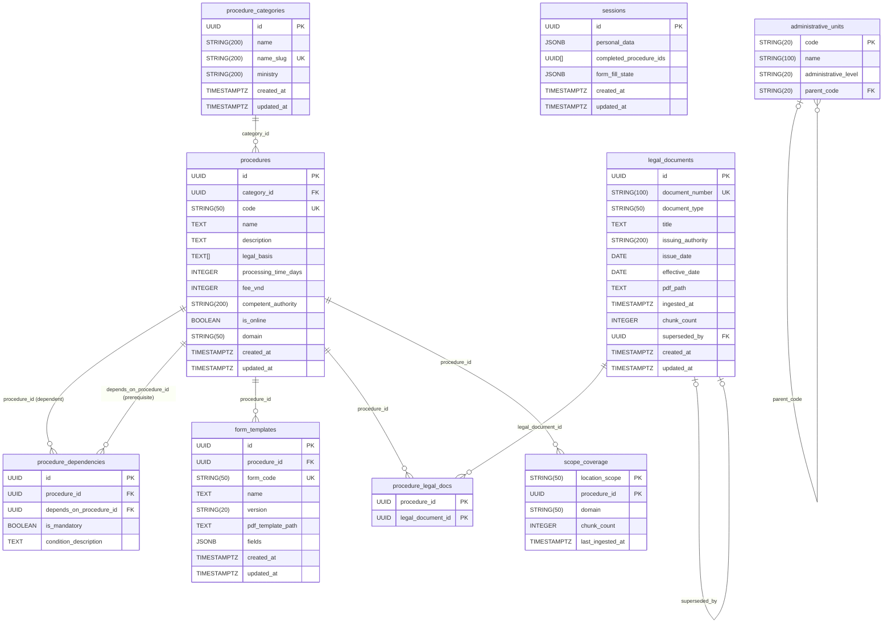

# Section 07 — Database Schema

## 7.1 Migration History

Three Alembic migration files define the full schema:

| Revision | File | Date | Summary |
|---|---|---|---|
| `0001` | `0001_initial_schema.py` | 2026-03-05 | 7 tables: procedure_categories, procedures, procedure_dependencies, form_templates, legal_documents, procedure_legal_docs, sessions |
| `0002` | `0002_legal_doc_versioning.py` | 2026-03-19 | Adds `superseded_by` FK self-reference to `legal_documents` |
| `0003` | `0003_jurisdiction_and_domain.py` | 2026-03-29 | Adds `domain` column to procedures; creates `administrative_units` and `scope_coverage` tables |

Total: **9 tables** across 3 migrations.

## 7.2 Entity-Relationship Diagram

## 7.3 Table Inventory

| Table | Purpose | PK Type | Notable Columns |
|---|---|---|---|
| `procedure_categories` | Groups procedures by ministry/domain | UUID (`gen_random_uuid()`) | `name_slug` (UK), `ministry` |
| `procedures` | Core procedure records with DAG-ready metadata | UUID (`gen_random_uuid()`) | `code` (UK), `legal_basis` (TEXT[]), `domain` (0003), `is_online` |
| `procedure_dependencies` | Self-referential adjacency list for procedure DAG | UUID | `is_mandatory`, `condition_description` (nullable TEXT — LLM-readable), unique(`procedure_id`, `depends_on_procedure_id`) |
| `form_templates` | Form template registry | UUID | `form_code` (UK), `pdf_template_path`, `fields` (JSONB) |
| `legal_documents` | Legal document registry and versioning | UUID | `document_number` (UK, nullable), `chunk_count`, `superseded_by` (self-FK, nullable) |
| `procedure_legal_docs` | Many-to-many: procedures ↔ legal_documents | Composite (procedure_id + legal_document_id) | — |
| `sessions` | PostgreSQL session storage (schema-level only) | UUID | `personal_data` (JSONB), `completed_procedure_ids` (UUID[]), `form_fill_state` (JSONB) |
| `administrative_units` | Hierarchical administrative geography | String code (PK, no UUID) | `administrative_level`, `parent_code` (self-FK), self-referential relationship |
| `scope_coverage` | Tracks which (location_scope, procedure_id) pairs have been ingested | Composite (location_scope + procedure_id) | `domain`, `chunk_count`, `last_ingested_at` |

## 7.4 Key Design Notes

### Primary Key Convention

All tables use `UUID` PKs generated via `gen_random_uuid()` except:
- `procedure_legal_docs`: composite PK (UUID + UUID)
- `scope_coverage`: composite PK (String + UUID)
- `administrative_units`: `code` String(20) PK — matches ISO 3166-2 subdivision codes (e.g., `"VN-HCM"`)

### Timestamp Convention

All tables with `TimestampMixin` use `TIMESTAMPTZ` (timezone-aware). The `TimestampMixin` sets `updated_at` with `onupdate=func.now()`. Tables without `TimestampMixin`: `procedure_dependencies`, `procedure_legal_docs`, `administrative_units`, `scope_coverage`.

### JSONB Columns

| Table | Column | Content |
|---|---|---|
| `form_templates` | `fields` | LLM-mapped form field definitions — cached result from `FormFieldMapper.map()`. In production: `null` for all rows (LLM mapper not called in active pipeline; `form_filler_fn` uses static `cccd_source` mapping from `form_field_configs.py` instead). |
| `sessions` | `personal_data` | Serialized `PersonalData` Pydantic model |
| `sessions` | `form_fill_state` | Partial form fill state between turns |

### Legal Document Versioning (0002)

`legal_documents.superseded_by` is a self-referential nullable FK. When a legal document is re-ingested (e.g., amended version), the old record's `superseded_by` is set to the new record's `id`. Qdrant chunks also receive `status="superseded"` payload (not tracked in PostgreSQL — managed entirely in Qdrant). The SQL FK is schema-only enforcement; the active/superseded state that actually governs RAG retrieval is the Qdrant `status` payload field.

### `domain` Column (0003)

Added to `procedures` with `server_default="housing"`. Valid values in practice: `"housing"`, `"civil_registration"`, `"adoption"`. **Important**: The `domain` column is present in the migration (`0003`) but is **not mapped in the ORM model** (`backend/app/models/procedure.py`). The `Procedure` SQLAlchemy model class does not declare a `domain` mapped attribute — the column exists in the database but cannot be read via the ORM without a raw SQL query. This is a known ORM model drift from the migration.

### `scope_coverage` Table (0003)

The composite PK is `(location_scope, procedure_id)`. The `procedure_id` FK has `ON DELETE CASCADE`. This table is upserted by `ingest_full_documents.py` after each document ingestion run. It enables the RAG scope cascade to distinguish "no legal content exists for this scope/procedure pair" from "content exists but hasn't been ingested yet."

### `sessions` Table vs Redis

The `sessions` PostgreSQL table exists but is **not the active session storage mechanism**. The live system stores session data in Redis (Fernet-encrypted, 3600s TTL) via `RedisService`. The PostgreSQL `sessions` table was defined in 0001 as a fallback/alternative but is not queried by any active endpoint or service. Session reads and writes in the chat pipeline go exclusively through `RedisService`.

### `procedure_dependencies.condition_description`

Nullable TEXT column for conditional dependency descriptions (e.g., "Chỉ áp dụng khi không phải cư dân thành phố"). The procedure planner (`procedure_planner_fn`) reads this text and passes it to the LLM for conditional dependency resolution. This design avoids modeling conditions as separate tables — the LLM interprets the natural-language description.

## 7.5 Pydantic Schema vs ORM Model Contrast

The Pydantic schemas in `backend/app/schemas/` are used for API request/response validation and internal data transfer. Key contrasts with ORM:

| Entity | ORM Model | Pydantic Schema | Notes |
|---|---|---|---|
| Session | `models/session.py` (PostgreSQL) | `schemas/session.py` (Redis) | Pydantic `SessionData` is the Redis contract; ORM `Session` is the PostgreSQL table. Different structures — Redis schema includes `conversation_history`, PostgreSQL schema does not. |
| PersonalData | No ORM model | `schemas/personal_data.py` | Stored in Redis `SessionData.personal_data` (serialized JSON) and Qdrant chunk metadata. No PostgreSQL row for PersonalData. |
| DocumentChunk | No ORM model | `schemas/rag.py:DocumentChunk` | Lives entirely in Qdrant as vector points with JSON payload. |
| FormField | No ORM model | `core/form_field_configs.py` TypedDict | Field configurations are hardcoded in `form_field_configs.py`, not in the database. The `form_templates.fields` JSONB column was designed to cache LLM-mapped field configs but is unpopulated in production. |
