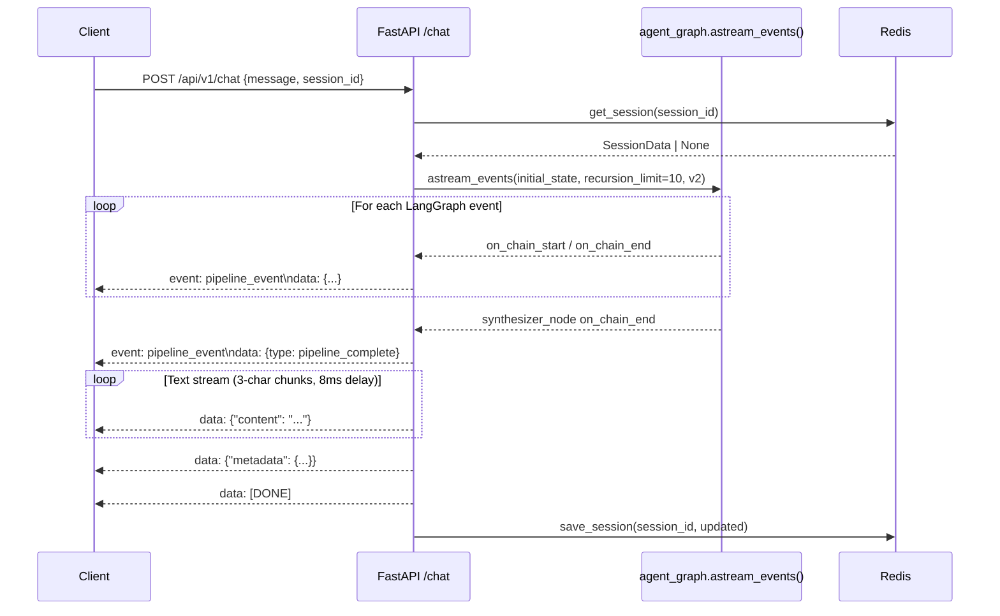

# Section 08 — API Surface

## 8.1 Router Registration

All API routes are mounted under `/api/v1` in `backend/app/main.py`:

```
/api/v1/chat        → app.api.v1.chat
/api/v1/procedures  → app.api.v1.procedures
/api/v1/documents   → app.api.v1.documents
/api/v1/forms       → app.api.v1.forms
/api/v1/legal       → app.api.v1.legal
/api/v1/feedback    → app.api.v1.feedback  (no sub-prefix — feedback.router mounts at root)
```

The health endpoint is registered directly on `app` (no `/api/v1` prefix).

## 8.2 Middleware Stack

In application order:
1. **SlowAPIMiddleware** — rate limiting via slowapi; 429 responses use custom `_rate_limit_handler` (JSON: `{"error": "rate_limit_exceeded", "detail": "Too many requests"}`)
2. **CORSMiddleware** — `allow_origins = CORS_ALLOW_ORIGINS + CORS_EXTRA_ORIGINS` (comma-separated, never wildcard); `allow_credentials=True`, `allow_methods=["*"]`, `allow_headers=["*"]`

## 8.3 Complete Endpoint Inventory

| Method | Path | Status | Rate Limited | Description |
|---|---|---|---|---|
| GET | `/health` | Implemented | No | Service health check; returns per-service booleans + GPU info; HTTP 503 only if embedding model not loaded |
| POST | `/api/v1/chat` | Implemented | 10/min | SSE streaming chat endpoint; runs LangGraph pipeline; emits pipeline events then text chunks |
| POST | `/api/v1/documents/upload` | Implemented | 5/min | Multipart upload: validates file, stores to MinIO, runs OCR (QR-first → PaddleOCR), saves PersonalData to Redis session |
| GET | `/api/v1/documents/download` | Implemented | 5/min | Download filled PDF from MinIO; 403 if `path` does not belong to `session_id` |
| POST | `/api/v1/forms/submit` | Implemented | No | Submit form data (manual or AI-filled); generates tracking code `DVC-YYYYMMDD-XXXXXX`; stores in `sessions.form_fill_state` JSONB |
| POST | `/api/v1/forms/fill` | Implemented | No | Fill a `.docx` form template + LibreOffice PDF conversion; returns PDF bytes |
| GET | `/api/v1/forms/configs/{procedure_id}` | Implemented | No | Returns ordered form configs for a procedure (tabs + field definitions) |
| GET | `/api/v1/forms/{form_id}` | Stub | No | `raise NotImplementedError` — never returns a response |
| GET | `/api/v1/procedures` | Stub | No | `raise NotImplementedError` |
| POST | `/api/v1/procedures` | Stub | No | `raise NotImplementedError` |
| GET | `/api/v1/procedures/{procedure_id}` | Stub | No | `raise NotImplementedError` |
| GET | `/api/v1/procedures/{procedure_id}/plan` | Stub | No | `raise NotImplementedError` |
| GET | `/api/v1/procedures/{procedure_id}/dependencies` | Stub | No | `raise NotImplementedError` |
| GET | `/api/v1/legal/search` | Stub | No | `raise NotImplementedError` |
| GET | `/api/v1/legal/documents` | Stub | No | `raise NotImplementedError` |
| GET | `/api/v1/legal/documents/{doc_id}` | Stub | No | `raise NotImplementedError` |
| POST | `/api/v1/feedback` | Implemented | No | Appends feedback entry to `backend/data/feedback.jsonl` (append-only); never raises on write failure |

**Implemented count**: 7 endpoints fully implemented, 1 health endpoint, 9 stubs.

## 8.4 Endpoint Detail

### GET /health

Returns a JSON body reporting per-service connectivity. Never crashes — all checks are wrapped in `try/except`. Returns HTTP 200 when embedding model is loaded, HTTP 503 when it is not.

```json
{
  "status": "ready",
  "embedding_model": "loaded",
  "services": {
    "qdrant": true,
    "redis": true,
    "postgres": true
  },
  "gpu": {
    "cuda_available": false,
    "device_name": null,
    "vram_total_mb": null
  }
}
```

### POST /api/v1/chat

**Request body** (`ChatRequest`):
```json
{
  "message": "string (1–2000 chars, blank stripped)",
  "session_id": "string (max 128 chars)",
  "image_path": "string | null",
  "citizen_id": "string | null"
}
```

**Response**: `StreamingResponse` with `media_type="text/event-stream"`

Two distinct SSE event formats are multiplexed in the same stream:

1. **Pipeline events** (emitted as each LangGraph node completes, before text):
   ```
   event: pipeline_event
   data: {"type": "<EVENT_TYPE>", ...fields}
   ```

2. **Text/metadata events** (backward-compatible format, emitted after graph completes):
   ```
   data: {"content": "<3-char Unicode chunk>"}
   data: {"metadata": {...}}
   data: [DONE]
   ```

**Pipeline event types** (from `schemas/pipeline_events.py`):

| Type | Emitted When | Key Payload Fields |
|---|---|---|
| `pipeline_start` | `router_node` begins | — |
| `plan_decided` | `router_node` ends | `execution_plan`, `domain`, `location_scope`, `procedure_id` |
| `enrichment_result` | `enrichment_node` ends (when plan produced) | `step_count` |
| `parallel_wave_start` | Wave of ≥2 workers begins | `workers`, `wave_index` |
| `worker_start` | Each individual worker begins | `worker` |
| `worker_complete` | Each worker wave ends | `worker`, `duration_ms` |
| `rag_result` | After `rag_fn` completes | `chunk_count`, `scope_used`, `confidence_tier`, `top_article` |
| `ocr_result` | After `ocr_fn` completes | `document_type`, `field_count`, `confidence` |
| `form_result` | After `form_filler_fn` completes | `filled_count`, `unfilled_required` |
| `pipeline_complete` | `synthesizer_node` ends | `total_ms`, `synthesizer_mode` |

**PII constraint**: Pipeline event payloads never contain raw PersonalData values — only field counts and confidence scores.

**Error handling**:
- `GraphRecursionError`: caught in the SSE generator; emits Vietnamese error text + `[DONE]`; HTTP 200 (never 500 from SSE)
- General exception: emits Vietnamese error text + metadata + `[DONE]`

**Session lifecycle per request**:
1. Load session from Redis (`get_session(session_id)`) — miss returns None → fresh `SessionData`
2. If `citizen_id` present and no `extracted_personal_data`, load citizen key from Redis (carry-forward)
3. State 1 → State 2 auto-advance: if `guided_step == 1` and `uploaded_document_path` is set, advance to `guided_step = 2`
4. Run `agent_graph.astream_events()` with `recursion_limit=10`, version="v2"
5. Save session back to Redis after graph completes — failure is logged, never propagates

### POST /api/v1/documents/upload

**Request**: multipart/form-data
- `file`: UploadFile (binary)
- `session_id`: string (Form field)
- `citizen_id`: string | None (Form field)

**Response** (`DocumentUploadResponse`):
```json
{
  "status": "success | partial",
  "tmp_path": "tmp/{session_id}/{uuid}.{ext}",
  "personal_data": { ... } | null,
  "ocr_confidence": 0.95,
  "message": "..."
}
```

`status="partial"` when OCR fails but the file is stored. `status="success"` when OCR returns PersonalData.

**Side effects**:
- Stores file at `tmp/{session_id}/{uuid}{ext}` in MinIO
- Saves `extracted_personal_data` and `uploaded_document_path` to Redis session
- If `citizen_id` provided and OCR succeeded, writes to `citizen:{citizen_id}:personal_data` Redis key (24h TTL)

**Security**: File validated via `validate_upload()` (magic byte MIME detection, extension check, size limit).

### GET /api/v1/documents/download

**Query params**: `path: str`, `session_id: str`

**Security guard**: Parses `path` as `{prefix}/{session_id_in_path}/{filename}`. Returns HTTP 403 if `path_parts[0]` is not `"tmp"` or `"forms"`, or if `path_parts[1] != session_id`.

**Response**: PDF bytes with `Content-Disposition: attachment; filename="to-khai-{procedure_code}.pdf"`; HTTP 404 on MinIO miss.

### POST /api/v1/forms/submit

**Request** (`FormSubmissionRequest`): includes `form_type`, `session_id`, `submission_mode` (`"manual"` | `"ai"`), `form_data` (structured form fields).

**Response**: `{"ma_ho_so": "DVC-YYYYMMDD-XXXXXX", "submitted_at": "...", "status": "received", "message": "..."}`

**Persistence**: Stores to `sessions.form_fill_state` JSONB via raw SQL (no dedicated `form_submissions` table). A `_submission_type: "form_submit"` marker distinguishes these rows from regular session records. The endpoint's docstring explicitly notes this is "a temporary measure."

### POST /api/v1/forms/fill

**Request** (`FillFormRequest`):
```json
{
  "procedure_id": "TTHC-001",
  "form_file": "1.MuCT01banhnhkmtheoThngts53.docx",
  "field_values": {"ho_ten": "Nguyễn Văn A", ...}
}
```

**Response**: PDF bytes with `Content-Disposition: attachment; filename="{stem}.pdf"`. Calls `doc_filler.fill_doc()` directly — bypasses the agent pipeline.

**Validation**: `form_file` must appear in `PROCEDURE_FORM_FILES[procedure_id]`. Returns HTTP 422 if not. Returns HTTP 404 if `.docx` template file not found on disk.

### GET /api/v1/forms/configs/{procedure_id}

**Response**:
```json
{
  "procedure_id": "TTHC-001",
  "forms": [
    {
      "form_file": "1.MuCT01banhnhkmtheoThngts53.docx",
      "tab_label": "CT01 — Tờ khai đăng ký cư trú",
      "fields": [ ... ]
    }
  ]
}
```

Returns HTTP 404 if `procedure_id` not in `PROCEDURE_FORM_FILES`.

### POST /api/v1/feedback

**Request** (`FeedbackRequest`):
```json
{
  "session_id": "...",
  "message_id": "...",
  "feedback": "helpful | unhelpful",
  "timestamp": "..."
}
```

**Response**: `{"status": "ok"}` — always HTTP 200. Write failure to `feedback.jsonl` is logged as warning and silently ignored.

**Storage**: Appends one JSON line to `backend/data/feedback.jsonl`. No DB write. `session_id` is partially redacted in logs (`[:8] + "..."`).

## 8.5 SSE Streaming Architecture



## 8.6 Rate Limiting Configuration

| Endpoint Group | Limit | Backend |
|---|---|---|
| `POST /api/v1/chat` | `CHAT_RATE_LIMIT` (default: `"10/minute"`) | slowapi (in-memory) |
| `POST /api/v1/documents/upload` | `UPLOAD_RATE_LIMIT` (default: `"5/minute"`) | slowapi |
| `GET /api/v1/documents/download` | `UPLOAD_RATE_LIMIT` (default: `"5/minute"`) | slowapi |
| All other endpoints | Unlimited | — |

Rate limit keys are derived from the client IP address (default slowapi behavior). 429 responses return JSON (not HTML).
