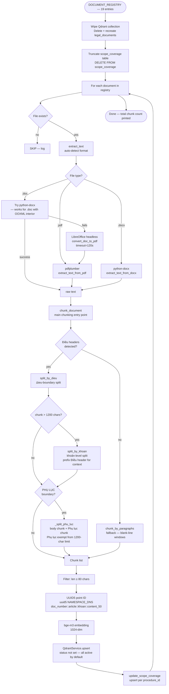

# Section 09 — Data Ingestion Pipeline

## 9.1 Active vs Inactive Scripts

| Script | Status | Description |
|---|---|---|
| `ingestion/ingest_full_documents.py` | **Active** | Full-collection ingestion with Điều/Khoản chunker. WIPES the Qdrant collection before re-ingesting. |
| `ingestion/ingest_legal_docs.py` | Reference only | Earlier script with soft-deprecate pattern (`batch_set_status`). Not used for live ingestion — kept for reference. |
| `ingestion/ingest_procedures.py` | Active (one-time) | Seeds procedures + dependency edges into PostgreSQL. Run once, not re-run on each ingestion. |
| `ingestion/ingest_manual_chunks.py` | Active (supplementary) | YAML-based manual chunk ingestion for content not derivable from source documents. |
| `ingestion/seed_administrative_units.py` | Active (one-time) | Seeds `administrative_units` table with VN subdivision codes. |

**Warning**: `ingest_full_documents.py` begins by deleting the entire Qdrant collection and truncating `scope_coverage`. It is a full-reset ingestion, not an incremental update.

## 9.2 Ingestion Pipeline Flowchart



## 9.3 DOCUMENT_REGISTRY — Full Inventory

19 source documents across 3 domains:

### Civil Registration (9 documents)

| Relative Path | Document Number | Title | Scope | Procedure IDs |
|---|---|---|---|---|
| `civil_registration/60.2014.QH13.doc` | `60/2014/QH13` | Luật Hộ tịch 2014 | VN | TTHC-CR-001, TTHC-CR-002 |
| `civil_registration/01.2022.TT.BTP.docx` | `01/2022/TT-BTP` | Thông tư 01/2022/TT-BTP | VN | TTHC-CR-001, TTHC-CR-002 |
| `civil_registration/1069.VBHN.BTP.pdf` | `1069/VBHN-BTP` | VBHN NĐ hộ tịch | VN | TTHC-CR-001, TTHC-CR-002 |
| `civil_registration/3884.VBHN.BTP.pdf` | `3884/VBHN-BTP` | VBHN TT hộ tịch | VN | TTHC-CR-001, TTHC-CR-002 |
| `civil_registration/18.2026.NĐ.CP.docx` | `18/2026/NĐ-CP` | NĐ 18/2026/NĐ-CP | VN | TTHC-CR-001, TTHC-CR-002 |
| `civil_registration/281.2016.TT.BTC.pdf` | `281/2016/TT-BTC` | Thông tư 281/2016/TT-BTC | VN | TTHC-CR-001, TTHC-CR-002 |
| `civil_registration/124.2016.NQ.HDND.doc` | `124/2016/NQ-HĐND` | NQ phí hộ tịch TP.HCM | VN-HCM | TTHC-CR-001, TTHC-CR-002 |
| `civil_registration/06.2020.NQ.HDND.doc` | `06/2020/NQ-HĐND` | NQ phí hộ tịch Hà Nội | VN-HN | TTHC-CR-001, TTHC-CR-002 |
| `civil_registration/05.2025.NQ.HDND.doc` | `05/2025/NQ-HĐND` | NQ phí hộ tịch Đà Nẵng | VN-DN | TTHC-CR-001, TTHC-CR-002 |

### Adoption (4 documents)

| Relative Path | Document Number | Title | Scope | Procedure IDs |
|---|---|---|---|---|
| `adoption/52.2010.QH12.doc` | `52/2010/QH12` | Luật Nuôi con nuôi 2010 | VN | TTHC-AD-001, TTHC-AD-002 |
| `adoption/275.VBHN.BTP.pdf` | `275/VBHN-BTP` | VBHN NĐ nuôi con nuôi (19/2011, 06/2025) | VN | TTHC-AD-001, TTHC-AD-002 |
| `adoption/951.VBHN.BTP.pdf` | `951/VBHN-BTP` | VBHN NĐ nuôi con nuôi + lệ phí | VN | TTHC-AD-001, TTHC-AD-002 |
| `adoption/3845.VBHN.BTP.pdf` | `3845/VBHN-BTP` | VBHN TT hồ sơ nuôi con nuôi | VN | TTHC-AD-001, TTHC-AD-002 |

### Housing (6 documents)

| Relative Path | Document Number | Title | Scope | Procedure IDs |
|---|---|---|---|---|
| `housing/68.2020.QH14.doc` | `68/2020/QH14` | Luật Cư trú 2020 | VN | TTHC-001, TTHC-002, TTHC-003 |
| `housing/154.2024.NĐ.CP.doc` | `154/2024/NĐ-CP` | NĐ 154/2024/NĐ-CP về cư trú | VN | TTHC-001, TTHC-002, TTHC-003 |
| `housing/53.2025.TT.BCA.pdf` | `53/2025/TT-BCA` | Thông tư 53/2025/TT-BCA | VN | TTHC-002, TTHC-003 |
| `housing/55.2021.TT.BCA.doc` | `55/2021/TT-BCA` | Thông tư 55/2021/TT-BCA | VN | TTHC-001, TTHC-002, TTHC-003 |
| `housing/66.2023.TT.BCA.doc` | `66/2023/TT-BCA` | Thông tư 66/2023/TT-BCA | VN | TTHC-001, TTHC-002, TTHC-003 |
| `housing/75.2022.TT.BTC.pdf` | `75/2022/TT-BTC` | Thông tư 75/2022/TT-BTC | VN | TTHC-001, TTHC-002, TTHC-003 |

**Jurisdictional coverage**: 3 city-level documents (`VN-HCM`, `VN-HN`, `VN-DN`) covering fee schedules; all other 16 documents at national scope (`VN`).

## 9.4 Chunking Strategy

### Primary: Điều-Boundary Chunker

1. **Article split**: `DIEU_PATTERN` splits text at `"Điều N."` or `"Điều N:"` boundaries. Each `Điều` section becomes one or more chunks. Preamble text (before the first `Điều`) is kept as article `"0"` but filtered by `MIN_CHUNK_CHARS`.

2. **Khoản split**: If an article chunk exceeds `MAX_CHUNK_CHARS = 1200`, it is further split at `^\d+\.\s` (top-level khoản pattern). Each khoản sub-chunk is prefixed with the parent Điều header line for context.

3. **`article_number` encoding**: When a khoản split produces a sub-chunk, `_extract_khoan_number()` checks the first 3 lines for a top-level numeric khoản pattern (`^\s*(\d+)\.\s+`). If found, `article_number` is encoded as `"Điều N Khoản M"`. This allows BM25 to discriminate between khoảns within the same article. Letter sub-divisions (`"a."`, `"b."`) are not extracted.

4. **Phụ lục split**: After khoản splitting, `_split_phu_luc()` scans each chunk for a `\nPHỤ LỤC\b` boundary. When found, the chunk is split into a body chunk (original `article_number`) and a `Phụ lục` chunk (`article_number="Phụ lục"`). **The Phụ lục chunk is exempt from the 1200-char limit** — fee tables must stay together to preserve semantic context.

### Fallback: Paragraph Chunker

Applied when no `Điều` headers are detected. Groups paragraphs (split on `\n{2,}`) into windows of at most `MAX_CHUNK_CHARS` characters. Assigns synthetic `article_number` values `"p1"`, `"p2"`, etc.

### Chunking Parameters

| Parameter | Value |
|---|---|
| `MAX_CHUNK_CHARS` | 1200 |
| `MIN_CHUNK_CHARS` | 80 |
| `DIEU_PATTERN` | `(?=^Điều\s+\d+[\.\:])` (multiline lookahead) |
| `KHOAN_PATTERN` | `(?=^\d+\.\s)` (multiline lookahead) |
| `_PHU_LUC_PATTERN` | `\nPHỤ LỤC\b` (case-insensitive) |

## 9.5 Text Extraction

| Format | Method | Notes |
|---|---|---|
| `.pdf` | `pdfplumber.open().pages[].extract_text()` | Text-based PDFs only; scanned PDFs produce empty strings |
| `.docx` | `python-docx` — `Document().paragraphs` | Used for `.docx` files and `.doc` files with OOXML interior |
| `.doc` | Try python-docx first → fallback to LibreOffice headless conversion | True binary `.doc` files require LibreOffice; timeout=120s; temp dir cleaned up in `finally` |

**LibreOffice path** (hardcoded): `C:\Program Files\LibreOffice\program\soffice.exe`. This is a Windows-only path — the ingestion script is not portable to Linux without modifying `LIBREOFFICE_EXE`.

## 9.6 UUID5 Point ID

Deterministic Qdrant point ID generation:

```python
point_id = str(uuid.uuid5(
    uuid.NAMESPACE_DNS,
    f"{meta['document_number']}::{chunk['article_number']}"
    f"::{chunk['khoan_number']}::{chunk['content'][:50]}",
))
```

The hash key includes `document_number`, `article_number`, `khoan_number`, and the **first 50 characters of content**. This means two chunks from the same article with different content produce different UUIDs — unlike a pure `(document_number, article_number)` key, this does not guarantee upsert deduplication across runs. A full re-run wipes the collection and re-creates all points.

**Note**: The active ingestion script uses `uuid.NAMESPACE_DNS`. The Section 04 documentation (from PROJECT_CONTEXT.md) references `uuid.NAMESPACE_OID` — this is a deviation. The actual implementation uses `NAMESPACE_DNS`.

## 9.7 Qdrant Point Payload Schema

Every upserted point carries:

```json
{
  "point_id": "UUID5 string",
  "document_number": "124/2016/NQ-HĐND",
  "document_name": "NQ phí hộ tịch TP.HCM",
  "domain": "civil_registration",
  "location_scope": "VN-HCM",
  "procedure_tags": ["TTHC-CR-001", "TTHC-CR-002"],
  "article_number": "Điều 3 Khoản 6",
  "khoan_number": "6",
  "content": "..."
}
```

**No `status` field is written by `ingest_full_documents.py`**. The `QdrantService._active_filter()` filters on `status == "active"` but the ingestion script does not set a `status` payload key. This means all freshly ingested points have `status=null` (not `"active"`) in Qdrant. The `_active_filter()` uses a `must` condition that would filter these points OUT.

This is a potential discrepancy: the active filter in `QdrantService` expects `status="active"`, but `ingest_full_documents.py` does not set `status` in the payload. Whether this causes silent empty results depends on how Qdrant handles missing payload keys in filter conditions — requires runtime verification to confirm behavior.

## 9.8 scope_coverage Updates

After each document is ingested, `update_scope_coverage()` upserts one row per `(location_scope, procedure_id)` pair into the `scope_coverage` PostgreSQL table. It calls `upsert_scope_coverage()` from `ingest_legal_docs.py` (imported from the reference script). This function is shared across both ingestion scripts.

## 9.9 Qdrant Collection Stats

From `docs/PROJECT_STATUS.md` v3.51: approximately **904 Qdrant points** after a full ingestion run across all 19 documents. This is the last known point count from the changelog — actual count is runtime-dependent.

Collection name: `legal_documents` (`QDRANT_COLLECTION` config value). Single collection for all domains.

## 9.10 What `docling` Is NOT Used For

`docling==2.5.0` is installed in `requirements.txt` but is **not imported or used** by `ingest_full_documents.py` or any active ingestion path. The active pipeline uses pdfplumber + python-docx for text extraction. Docling appears to be an installed dependency that was considered but not integrated into the production ingestion path.
