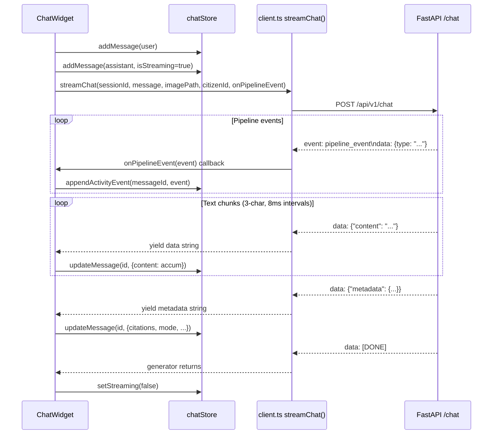

# Section 10 — Frontend Architecture

## 10.1 Technology Stack

- **Framework**: Next.js 14.2.14 (App Router, SSR/SSG hybrid)
- **UI**: Tailwind CSS 3.4.x, React 18
- **State**: Zustand 5.0 (with `persist` middleware)
- **Forms**: React Hook Form 7.53 + Zod 3.23
- **SSE**: Native `fetch` + `ReadableStream` (manual SSE parser, no EventSource API)
- **SSE parsing library**: `eventsource-parser==^2.0.1` (installed but manual parsing used in `client.ts`)
- **Icons**: lucide-react

## 10.2 Page Inventory

All pages are under `frontend/src/app/`:

| Route | File | Description |
|---|---|---|
| `/` | `page.tsx` | Home page — portal landing with stat boxes, service grid |
| `/chat` | `chat/page.tsx` | Full-page chat with sidebar procedure plan panel |
| `/dich-vu-cong` | `dich-vu-cong/page.tsx` | Public administration services listing |
| `/tra-cuu-ho-so` | `tra-cuu-ho-so/page.tsx` | Submission lookup by tracking code |
| `/cau-hoi-thuong-gap` | `cau-hoi-thuong-gap/page.tsx` | FAQ page |
| `/danh-gia-chat-luong` | `danh-gia-chat-luong/page.tsx` | Quality index / satisfaction survey |
| `/thanh-toan` | `thanh-toan/page.tsx` | Payment page |
| `/thu-tuc/dang-ky-thuong-tru` | `thu-tuc/dang-ky-thuong-tru/page.tsx` | Permanent residence registration procedure page |
| `/thu-tuc/dang-ky-tam-tru` | `thu-tuc/dang-ky-tam-tru/page.tsx` | Temporary residence registration procedure page |
| `/thu-tuc/xac-nhan-cu-tru` | `thu-tuc/xac-nhan-cu-tru/page.tsx` | Residence confirmation procedure page |
| `/thu-tuc/dang-ky-khai-sinh` | `thu-tuc/dang-ky-khai-sinh/page.tsx` | Birth registration procedure page |
| `/thu-tuc/cap-ban-sao-trich-luc` | `thu-tuc/cap-ban-sao-trich-luc/page.tsx` | Certified copy request procedure page |
| `/thu-tuc/dang-ky-nuoi-con-nuoi` | `thu-tuc/dang-ky-nuoi-con-nuoi/page.tsx` | Adoption registration procedure page |
| `/thu-tuc/dang-ky-lai-nuoi-con-nuoi` | `thu-tuc/dang-ky-lai-nuoi-con-nuoi/page.tsx` | Re-registration of adoption procedure page |

**Total**: 14 pages (7 portal pages + 7 procedure pages under `/thu-tuc/`). A `loading.tsx` stub exists under `thu-tuc/`.

Layout: `app/layout.tsx` — root layout with `Header` component (includes PIN gate logout button) and `FloatingChatWidget` mounted on all pages.

## 10.3 Authentication

**PIN gate** (`components/auth/PinGate`): Prompts for a 4-digit PIN on first visit. The PIN is configurable via `NEXT_PUBLIC_ACCESS_PIN` env var (default: `"2026"`). On success, stores the auth state in `sessionStorage`. The gate wraps the root layout — all pages require PIN entry. This is a dev/demo access control mechanism, not production authentication.

## 10.4 Component Architecture

### ChatWidget

`frontend/src/components/chat/ChatWidget.tsx` — the core AI chat component.

Two variants:
1. **Floating** (`FloatingChatWidget` wrapper): Fixed bottom-right button that opens a 360×520px chat panel — mounted in root layout, appears on all pages
2. **Inline**: Full-page chat used by `/chat` page

Features:
- Animated typing indicator (3 bouncing dots)
- Citation chips with `title` attribute for hover excerpt display
- File attachment button (CCCD upload flow)
- Guided procedure progress bar (4-step wizard): `GUIDED_STEP_LABELS = ['Giới thiệu thủ tục', 'Tải lên CCCD', 'Điền tờ khai', 'Hoàn thành']`
- Error recovery with retry button
- Feedback buttons (helpful/unhelpful) per message → `POST /api/v1/feedback`
- `AgentActivityPanel` embedded above each assistant message (TASK-SHOWCASE)

### AgentActivityPanel

`frontend/src/components/chat/AgentActivityPanel.tsx` — real-time pipeline activity timeline (added v3.80).

Tied to a single assistant message (not a global sidebar). Displays pipeline steps as a vertical timeline with status icons (spinner → checkmark). Parallel waves rendered side-by-side.

**Auto-expand behavior**:
- Expands on `pipeline_start` event (when streaming begins)
- Collapses 3 seconds after `pipeline_complete`
- Demo mode (`NEXT_PUBLIC_AGENT_ACTIVITY_DEFAULT_OPEN=true`): always expanded

**Domain/scope labels**: Maps `"housing"` → `"Nhà ở"`, `"VN-HCM"` → `"TP. HCM"`, etc.

## 10.5 Zustand Store Inventory

### chatStore (persisted to sessionStorage)

Persistence key: `"dvc-chat-session"`. Persisted fields: `sessionId`, `messages`, `guidedProcedureId`, `guidedStep`, `personalData`. Non-persisted: `isOpen`, `isStreaming`, `uploadedFile`, `procedurePlan`, `activityByMessageId`.

| Field | Type | Description |
|---|---|---|
| `isOpen` | `boolean` | Chat panel open state (floating variant) |
| `sessionId` | `string` | UUID generated on first load; persisted in sessionStorage (tab-scoped) |
| `citizenId` | `string` | Cross-session UUID stored in localStorage (24h carry-forward for PersonalData) |
| `messages` | `ChatMessage[]` | Full chat history for current session |
| `isStreaming` | `boolean` | True while SSE stream is active |
| `uploadedFile` | `UploadedFile \| null` | Currently attached CCCD file |
| `procedurePlan` | `ProcedureStep[] \| null` | Procedure DAG plan from last response |
| `guidedProcedureId` | `string \| null` | Active guided procedure (wizard mode) |
| `guidedStep` | `number \| null` | Wizard step: 0=INTRO, 1=AWAIT_CCCD, 2=FORM_FILLING, 3=COMPLETE |
| `personalData` | `PersonalData \| null` | Last OCR result; persisted for cross-turn carry-forward |
| `activityByMessageId` | `Record<string, PipelineEvent[]>` | Pipeline events per message ID for AgentActivityPanel |

Key actions: `addMessage`, `updateMessage`, `removeLastMessage`, `setStreaming`, `appendActivityEvent`, `clearSession`, `injectWelcomeMessage`.

`citizenId` uses `localStorage` separately (cross-tab, cross-session) while `sessionId` uses `sessionStorage` (tab-scoped). The `citizenId` is sent to the backend on each chat request and document upload; the backend uses it to look up cached PersonalData in Redis (24h TTL).

### formStore (NOT persisted)

Per-form-type field registry with confidence-wins merge rule mirroring `SessionDataAccumulator.merge()`.

| Field | Type | Description |
|---|---|---|
| `fields` | `Record<FormType, Record<string, FieldState>>` | Per-form-type field registry |
| `submissionResult` | `Record<FormType, FormSubmissionResponse \| null>` | Last form submission result |
| `isSubmitting` | `Record<FormType, boolean>` | Submission in-progress flags |

Form types: `"thuong-tru"`, `"tam-tru"`, `"xac-nhan"`.

`FieldState`: `{ value: string, source: 'manual' | 'ai', confidence: number, aiHighlight: boolean }`.

`applyAIExtraction()` implements the carry-forward merge rule: higher confidence wins. AI-filled fields get `aiHighlight=true` for visual differentiation.

### procedureStore (NOT persisted)

| Field | Type | Description |
|---|---|---|
| `selectedProcedureId` | `string \| null` | Currently selected procedure |
| `executionPlan` | `ProcedureStep[]` | Resolved procedure plan |
| `completedProcedureIds` | `string[]` | IDs of completed procedures |

### navigationStore

Exists but is a minor store for navigation state (not examined in detail — not relevant to the core AI pipeline).

## 10.6 SSE Streaming Flow

**SSE parsing details** (`client.ts`): Manual line-by-line parsing without EventSource API. Maintains a `currentEventType` variable that resets on blank lines (SSE event boundary). Pipeline events (`event: pipeline_event`) are routed to the `onPipelineEvent` callback and never yielded. All other `data:` lines are yielded as strings.

## 10.7 Citation Rendering

`frontend/src/lib/renderCitations.tsx` — `renderWithCitations()`.

Scans assistant message text for citation patterns matching backend format (`[Điều X, ...]`). Renders matched citations as styled `` chips with scrollable hover tooltips showing the chunk excerpt. Unverified citations (`[unverified: ...]`) render in a distinct style.

`CitationChips` component in `ChatWidget.tsx` renders citation chips below the message bubble. Each chip uses `title={c.excerpt}` for hover preview (HTML tooltip, not custom popover).

## 10.8 API Client Layer (`client.ts`)

Base URL: `NEXT_PUBLIC_API_URL_PUBLIC || NEXT_PUBLIC_API_URL || 'http://localhost:8000'`.

**Ngrok support**: When base URL contains `"ngrok"`, injects `"ngrok-skip-browser-warning": "true"` header to bypass the Ngrok browser warning interstitial page.

**`apiFetch<T>()`**: Generic JSON fetch wrapper; throws on non-2xx with status code in error object.

**`streamChat()`**: Returns an `AsyncGenerator<string>`. Accepts optional `onPipelineEvent` callback for pipeline event routing. Backward-compatible — callers without the callback receive the same text data as before.

**`api` object** (non-streaming endpoints): `procedures.stats/list/detail`, `faq.list`, `submissions.lookup`, `qualityIndex.list`, `documents.upload`, `forms.submit`. Several of these point to backend stub endpoints (`/api/v1/procedures/stats`, `/api/v1/faq`, `/api/v1/submissions`) that raise `NotImplementedError` — the frontend calls them but receives 500 errors in practice.

## 10.9 Form Field Configs (Frontend)

`frontend/src/data/formFieldConfigs.ts` — mirrors `backend/app/core/form_field_configs.py` but uses a TypeScript format for the frontend `ProcedureForm` component. Controls which fields are rendered in the form tabs on each procedure page. The frontend form field definitions are manually maintained in sync with the backend — there is no auto-generation or schema sharing mechanism.
